# AdROD: HyperNetwork-based Adversarially Robust Object Detection for Autonomous Driving

This repository accompanies the accepted paper **AdROD: HyperNetwork-based
Adversarially Robust Object Detection for Autonomous Driving**. It provides
demonstration media, released adversarial patches, evaluation images,
paper-reported configurations, and result summaries.

📄 **Paper:** [AdROD camera-ready PDF](AdROD_camera_ready.pdf)

> **Public research companion.** The AdROD implementation, trained
> checkpoints, patch-generation code, and runnable training/evaluation pipeline
> are not included because the technology is subject to patent-related
> restrictions. See [`NOTICE`](NOTICE) and [`LICENSE`](LICENSE).

## Abstract

Camera-based object detection is safety-critical in autonomous driving, yet
physical adversarial patches can suppress detections of road objects. AdROD
uses a stochastic ensemble of detectors generated by low-rank HyperNetworks,
combined with functionally diverse input transformations. AdROD-I performs
uncertainty-based recovery, while AdROD-II activates the ensemble on demand
when tracked objects disappear abnormally.

## AdROD and baseline defenses

  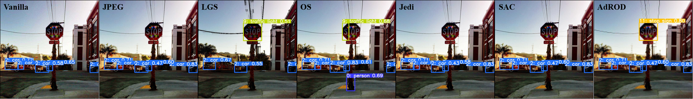

From left to right: Vanilla detector, JPEG compression, Local Gradient
Smoothing, ObjectSeeker, Jedi, Segment and Complete, and AdROD.

## How AdROD works

  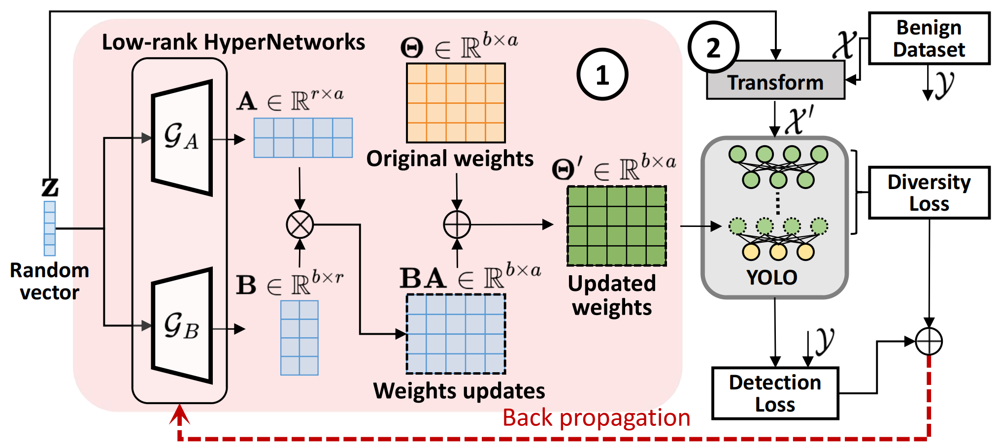

  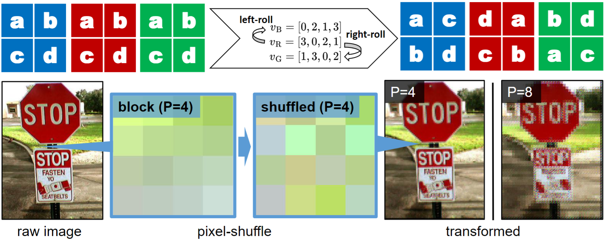

| AdROD-I: uncertainty-based recovery | AdROD-II: on-demand ensemble activation |
| --- | --- |
| 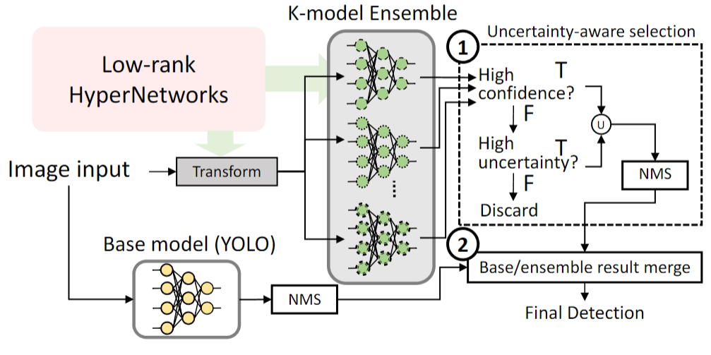 | 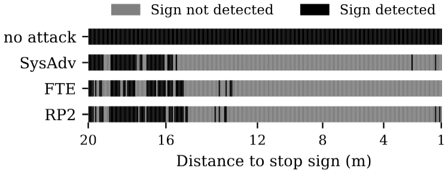 |

## Qualitative detection recovery

The first row shows predictions from an undefended detector under adversarial
patches; the second row shows the corresponding AdROD recovery results.

  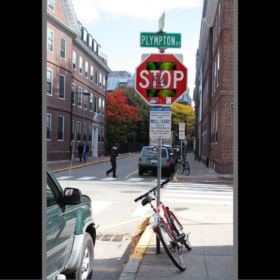
  
  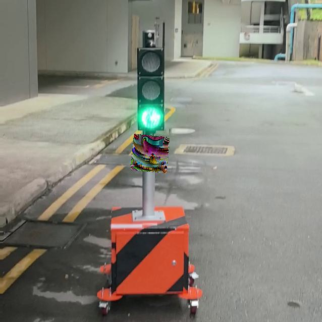
  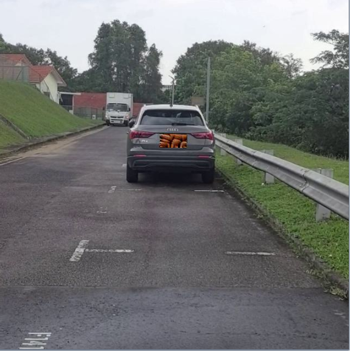
   
  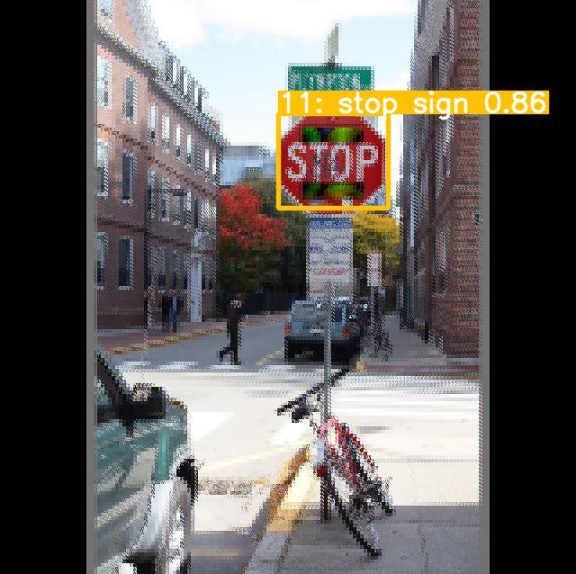
  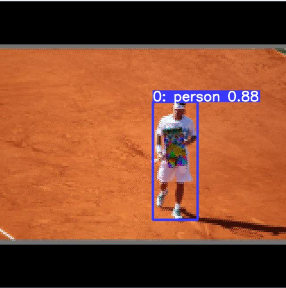
  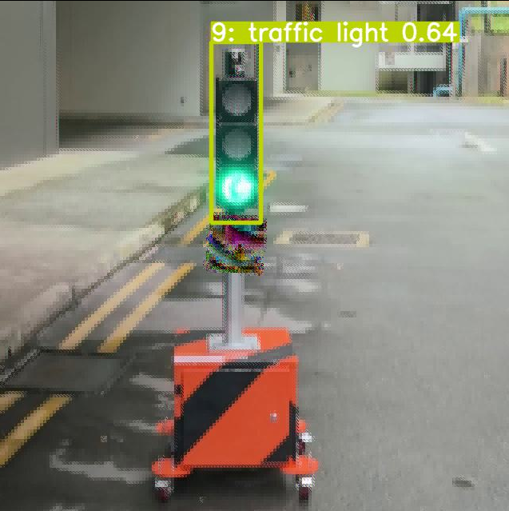
  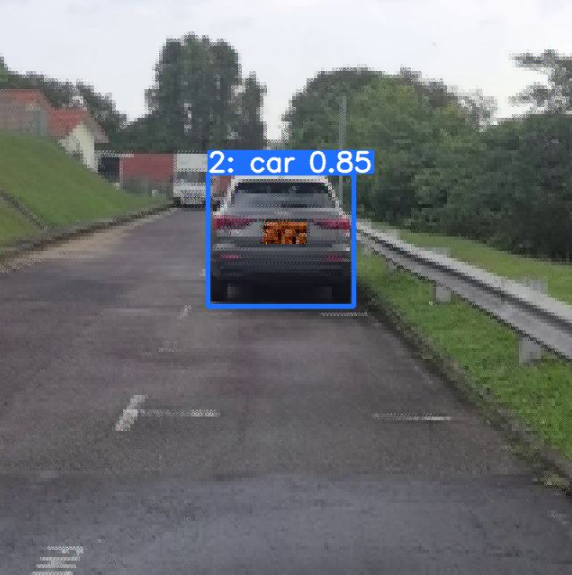

## Demonstrations

### Indoor physical SysAdv attack

AdROD-I uses a fixed ensemble size; AdROD-II adapts its ensemble activation.

  
  
  

<em>Left to right: Vanilla detector, AdROD-I, AdROD-II.</em>

### Outdoor physical SysAdv attack

The outdoor sequence illustrates AdROD-II switching from the base detector to
the ensemble defense after its anomaly trigger.

  
  
  

<em>Left to right: Vanilla detector, AdROD-I, AdROD-II.</em>

### End-to-end driving safety demonstration

This selected OpenCDA demonstration uses a stop-sign testbed at a reference
speed of 40 km/h. Without defense, the driving agent misses the stop sign;
with AdROD, the detection is recovered before the stop line.

  
  
  

<em>Left to right: No defense, AdROD-I, AdROD-II.</em>

## Released research assets

- [`patches/`](patches/): adversarial-patch images and their original JSON
  configuration metadata. Patch-generation code is not included.
- [`evaluation_data/`](evaluation_data/): released road/laboratory sequences
  and COCO-derived person/stop-sign subsets. See
  [`DATASET_LICENSES.md`](DATASET_LICENSES.md) for provenance, attribution, and
  privacy information.
- [`configs/`](configs/): paper-reported HyperNetwork settings and evaluation
  protocol descriptions.
- [`docs/ARCHITECTURE.md`](docs/ARCHITECTURE.md): non-executable architecture
  specification for the YOLOv5/HyperNetwork ensemble and its two serving modes.
- [`results/reported_results.csv`](results/reported_results.csv): selected
  paper-reported ASR values.

The assets are provided for research inspection. This repository does not
contain the executable detector or evaluator required to run the protocols.

## Citation and release boundary

Please cite the accepted AdROD paper when using these materials. This
repository is not an offer of source code, model weights, or permission to
implement or deploy AdROD. Distribution terms for the content present here are
given in [`LICENSE`](LICENSE); patent-related terms are stated in
[`NOTICE`](NOTICE).
